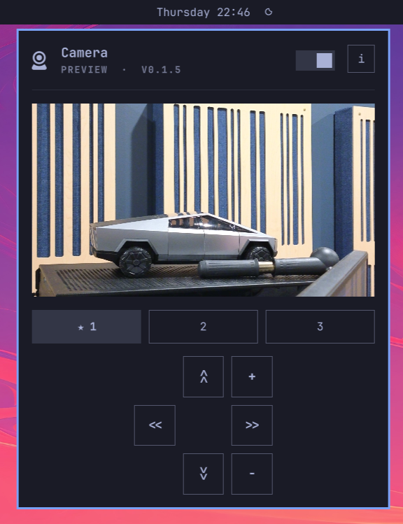

# Insta360 Link Controller for Omarchy



Omarchy bar plugin for an Insta360 Link webcam. Icon in the bar, PTZ pad in the popout, three presets. When another app starts video, the first preset is applied.

Works with the original Link (`2e1a:4c01`) as a UVC device. No vendor SDK.

100% of the credit goes to [Grok Build](https://grok.com/build) and [DHH](https://github.com/DHH) for enabling us to do this sort of thing. I went from having an awesome webcam I couldn't use (due to lack of Linux support) to having control over its basic functions within an hour!

## Install

```sh
omarchy plugin add https://github.com/Critters/Insta360Link.git --enable --yes
```

Then:

```sh
omarchy bar move insta360-link --section right
```

Needs `v4l-utils` and `python3`.

## Use

- Click the camera icon for the panel.
- Preview is off until you toggle it. Close the panel and it drops the stream so Zoom/OBS can take the camera.
- Click a preset tab to move there. Nudge with the pad or arrow keys. Changes write back into that preset after a short pause.
- Double-click a tab to rename. Right-click a tab (or press `d`) to mark it as the default for the next video session.
- `1` `2` `3` select presets. `p` toggles preview. `+` / `-` zoom.

When Firefox, Chrome, Zoom, Discord, or OBS starts video, the starred preset is applied.

## Config

`~/.config/omarchy/ptz.json` is created on first save. Three presets, and which one is default.

Debug the helper without the shell:

```sh
python3 ptz.py occupancy
python3 ptz.py get
python3 ptz.py set 0 0 100
```

## Remove

```sh
omarchy plugin remove insta360-link
```
